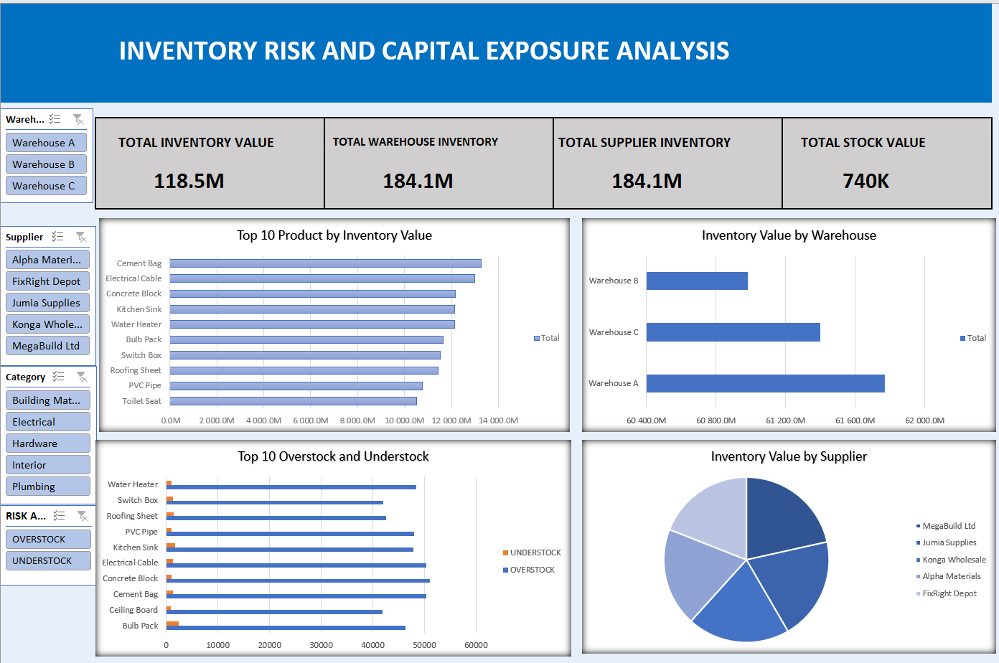

#  Inventory Risk and Capital Exposure Analysis
## Project overview
This project analyzes inventory and sales data to identify stock risks and optimize capital allocation.
## Key Objectives
* Monitor inventory levels
* Identify risk areas like understocked and overstocked products
* Analyze capital tied up in inventory
* Highlight operational concerns
## Dataset Information
The Dataset used in this project was gotten from Easy Technologies Academy EasyTech Talent March 2026 challenge. It contained an inventory datasets of 3,000 products records across 3 warehouses , 5 suppliers and 5 product categories. The datasets contains sales and inventory datasets including product performance and stock levels.
# Exploratory Data Analysis (EDA)
* Cleaned and structured the datasets
* Analyzed sales trends and inventory distribution
* Identified patterns in stock movement
## Key Insights
* Warehouse A has the largest inventory value meaning that it has the most money locked in inventory.
* The inventory is fairly distributed across all supplies and no supplier appears dominant. This means that no major supplier dependency risk is visible.
* Inventory appears slightly concentrated in warehouse A, though distribution still exists across warehouses
* Several products show overstock risk and few products are understock as well.
* Diversify supplier sourcing for critical inventory items to reduce potential supply chain disruption.
### Recommendations
* Reduce future purchase orders for overstocked products and introduce reorder limits to prevent excess stock
* Redistribute inventory more evenly across all warehouses and use demand forcasts to determine optimal stock levels per location
* Avoid tying too much capital in slow moving high value inventory
* Adopt a real time inventory monitoring system using tools like Power Bi and Microsoft Excel for early identification of stocks risks.
* ## Tools Used
* Microsoft Excel
* Pivot Tables
* Pivot Charts
* Slicers
## Dashboard

